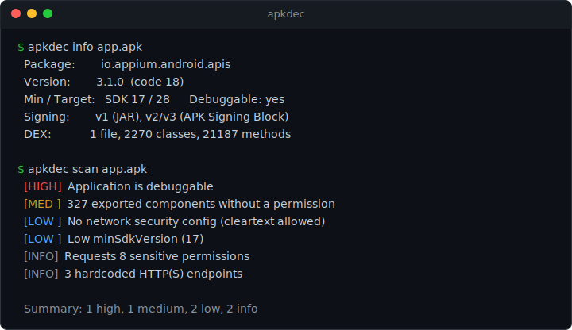

# apkdec

> Cross-platform, dependency-free CLI APK decompiler & inspector — runs on **macOS, Windows and Linux**.

[](https://github.com/emrezdemir/apk-decompiler/actions/workflows/ci.yml)
[](https://www.python.org/)
[](LICENSE)

`apkdec` inspects and decompiles Android `.apk` files from the command line.

The **core is pure Python with zero third-party dependencies and no JVM** — it
decodes the binary `AndroidManifest.xml`, summarizes the APK, inspects DEX
bytecode and extracts contents anywhere Python 3.8+ runs. For full **Java source**
or **smali** decompilation it transparently downloads and drives the best-in-class
JVM tools ([jadx](https://github.com/skylot/jadx) and
[apktool](https://github.com/iBotPeaches/Apktool)).

<p align="center">
  
</p>

> ⚠️ **For education, interoperability, malware analysis and _authorized_ security
> testing only.** Only analyze software you own or are explicitly permitted to
> analyze. You are solely responsible for your use of this tool. See
> **[DISCLAIMER.md](DISCLAIMER.md)** for the full terms — by using `apkdec` you
> accept them.

## Features

| Command | What it does | Needs Java? |
| --- | --- | --- |
| `info` | Package, versions, SDK levels, permissions, components, native libs, signing scheme | ❌ |
| `scan` | **Security review**: manifest hardening, exported attack surface, risky permissions, weak signing, hardcoded secrets | ❌ |
| `manifest` | Decode binary `AndroidManifest.xml` → readable text XML | ❌ |
| `extract` | Unzip the APK and write a decoded manifest alongside | ❌ |
| `dex` | DEX statistics, optionally list every class name | ❌ |
| `strings` | Dump strings from all DEX files | ❌ |
| `decompile` | Full **Java source** (jadx) or **smali + resources** (apktool) | ✅ |
| `wizard` | Interactive guided menu — no flags to remember | ❌ |
| `setup` | Download the JVM engines & check the Java runtime | — |
| `doctor` | Report your environment and installed tools | — |

Everything in the first six rows works **out of the box** — no Java, no `pip`
dependencies, no network.

## Quick start — one command, no install

Clone and run with the bundled launcher. **No `pip install`, no setup** — just
Python 3.8+.

```bash
git clone https://github.com/emrezdemir/apk-decompiler.git
cd apk-decompiler

# macOS / Linux
./apkdec info app.apk

# Windows (PowerShell)
.\apkdec.ps1 info app.apk

# Windows (cmd, or just double-click apkdec.bat)
apkdec.bat info app.apk
```

### Interactive mode (easiest)

Run the launcher with **no arguments** (or double-click `apkdec.bat` on Windows)
to open a guided menu — pick your APK (drag-and-drop works) and choose an action.
No flags to remember:

```text
======================================================
  apkdec 0.1.0 - interactive mode
======================================================
APK path (or drag & drop the file here): app.apk

File: app.apk
  1) Show APK info
  2) Security scan
  3) Decode AndroidManifest.xml
  4) Extract APK contents
  5) DEX statistics
  6) List all classes
  7) Dump DEX strings
  8) Decompile to Java source (jadx, needs Java)
  9) Decompile to smali (apktool, needs Java)
  10) Environment check (doctor)
  c) Choose a different APK
  q) Quit
Select:
```

You can also launch it explicitly with `apkdec wizard`.

## Install (optional) — make `apkdec` a global command

If you'd rather type `apkdec` from anywhere (instead of the bundled launchers),
run the **first-run installer** for your platform. It checks your Python, installs
the command, and runs a health check.

```bash
# macOS / Linux
sh scripts/install.sh

# Windows (PowerShell)
powershell -ExecutionPolicy Bypass -File scripts\install.ps1

# Windows — or just double-click  scripts\install.bat
```

On Windows the installer also offers a **Desktop shortcut** that opens the
interactive wizard with a double-click (pass `-NoShortcut` to skip it).

Prefer to do it by hand? `pip install .` works too, and you can always run it as a
module with `python -m apkdec --help`.

Requirements:

- **Python 3.8+** for the core.
- **A JDK (17+ recommended)** only if you use `apkdec decompile`. `apkdec doctor`
  tells you whether it can find one, and `apkdec decompile` prints
  OS-specific install instructions if it cannot.

## Usage

```bash
# Inspect an APK (no Java required)
apkdec info app.apk
apkdec info app.apk --json          # machine-readable

# Static security review (no Java required)
apkdec scan app.apk                 # manifest issues, attack surface, secrets
apkdec scan app.apk --json          # machine-readable

# Recover a readable AndroidManifest.xml
apkdec manifest app.apk
apkdec manifest app.apk -o AndroidManifest.xml

# Unpack everything + decode the manifest
apkdec extract app.apk -o app_unpacked

# Look at the bytecode
apkdec dex app.apk                  # per-dex stats
apkdec dex app.apk --classes        # list every class
apkdec strings app.apk --min-len 6  # interesting strings only

# Full decompilation (downloads jadx/apktool on first use)
apkdec decompile app.apk -o app_src             # Java source via jadx
apkdec decompile app.apk -e apktool -o app_dec  # smali + resources via apktool

# Environment & tooling
apkdec doctor
apkdec setup --tool all
```

### How decompilation works

`apkdec decompile` keeps the heavy lifting where it belongs — in the mature,
well-maintained JVM decompilers:

1. It checks for a Java runtime (`JAVA_HOME` or `java` on `PATH`).
2. On first use it downloads the chosen engine into a per-user cache
   (`~/.apkdec/`, overridable via the `APKDEC_HOME` environment variable),
   pinning the latest GitHub release with an offline fallback.
3. It runs the engine and streams its output.

This gives you the convenience of a single cross-platform CLI without
reimplementing a Java decompiler.

### Security review (`scan`)

`apkdec scan` gives a fast, dependency-free triage — the first pass a reviewer
makes before deep-diving. It reports, with severity levels:

- **Manifest hardening** — `debuggable`, `allowBackup`, cleartext traffic,
  missing network-security-config, `testOnly`.
- **Attack surface** — exported activities/services/receivers/providers that have
  no guarding permission (reachable by other apps).
- **Permissions** — sensitive/dangerous permissions the app requests.
- **Signing** — missing signature or legacy v1-only signing (Janus,
  CVE-2017-13156).
- **Hardcoded secrets** — API keys, tokens, private-key blocks and endpoints
  found in the bytecode (printed redacted).

```bash
apkdec scan app.apk
```

Findings are **leads for manual review, not confirmed vulnerabilities**, and the
absence of findings is not proof of security. `scan` exits non-zero when a
high-severity issue is found, so it slots into CI.

## Why another APK tool?

- **Truly cross-platform & portable** — one `pip install`, identical commands on
  macOS, Windows and Linux.
- **Works without Java** for the most common tasks (inspecting a manifest,
  reading metadata, listing classes). No 200 MB toolchain just to read a package
  name.
- **Zero third-party Python dependencies** — only the standard library, so it is
  easy to audit and trivial to vendor into CI.
- **Scales up** to real Java/smali output when you need it.

## Project layout

```
apkdec, apkdec.bat, apkdec.ps1   # zero-install launchers (macOS/Linux, cmd, PowerShell)
scripts/
  install.sh                     # first-run installer (macOS/Linux)
  install.ps1, install.bat       # first-run installer (Windows) + desktop shortcut
docs/
  screenshot.svg                 # terminal screenshot used in this README
src/apkdec/
  axml.py        # binary AndroidManifest.xml (AXML) decoder  — pure Python
  dex.py         # Dalvik .dex header / table reader          — pure Python
  apk.py         # high-level APK info, extraction, summaries  — pure Python
  security.py    # static security analysis (scan)            — pure Python
  tools.py       # Java detection + jadx/apktool management
  decompile.py   # orchestration of the JVM engines
  cli.py         # argparse command-line interface
tests/           # synthesized binary fixtures + unit tests (no real APK shipped)
```

## Development

```bash
pip install -e ".[dev]"
pytest
```

The test-suite synthesizes valid AXML, DEX and APK byte streams in-memory, so it
runs fast and ships no copyrighted binaries.

## Legal & ethical use

`apkdec` is intended for **education, interoperability, security research,
malware analysis, and debugging your own apps**. Only decompile software you own
or are explicitly authorized to analyze. Respect the license and terms of any app
you inspect and the laws of your jurisdiction.

**The software is provided "AS IS" with no warranty. You are solely responsible
for your use of it and any consequences. The authors assume no liability.** This
is a condition of use — read the full **[DISCLAIMER.md](DISCLAIMER.md)** (terms of
use, acceptable use, and limitation of liability) before using the tool.

Found a vulnerability **in apkdec itself**? See **[SECURITY.md](SECURITY.md)**.

## Acknowledgements

Full decompilation is powered by the excellent
[**jadx**](https://github.com/skylot/jadx) and
[**apktool**](https://github.com/iBotPeaches/Apktool) projects.

## License

[MIT](LICENSE)

---

### Türkçe özet

`apkdec`, komut satırından çalışan, **macOS / Windows / Linux** uyumlu bir APK
inceleme ve decompile aracıdır. Çekirdek özellikler (manifest çözme, paket
bilgisi, DEX inceleme, içerik çıkarma) **saf Python ile, Java veya ek bağımlılık
gerektirmeden** çalışır. Tam **Java kaynak kodu** veya **smali** çıktısı için
`jadx` ve `apktool` araçlarını otomatik indirir (bunun için Java gerekir).

**Kurulum gerektirmeden tek komutla** çalıştırabilirsiniz (sadece Python 3.8+
yeterli). Argümansız çalıştırınca (Windows'ta `apkdec.bat`'a çift tıklayınca)
**interaktif menü** açılır — APK'yı sürükle-bırak yapıp işlemi seçmeniz yeterli.

```bash
./apkdec                        # interaktif sihirbaz (macOS/Linux)
.\apkdec.ps1                    # interaktif sihirbaz (Windows PowerShell)

./apkdec info uygulama.apk      # paket adı, sürüm, izinler (Java gerekmez)
./apkdec scan uygulama.apk      # güvenlik taraması (Java gerekmez)
./apkdec manifest uygulama.apk  # AndroidManifest.xml'i okunur hale getirir
./apkdec decompile uygulama.apk # jadx ile Java kaynak koduna çevirir
```

`apkdec`'i her yerden çağrılabilen global komut yapmak ve (Windows'ta) masaüstü
kısayolu oluşturmak için ilk kurulum scriptini çalıştırın:

```bash
sh scripts/install.sh                                          # macOS/Linux
powershell -ExecutionPolicy Bypass -File scripts\install.ps1   # Windows
# veya Windows'ta scripts\install.bat dosyasına çift tıklayın
```
